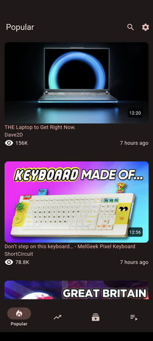
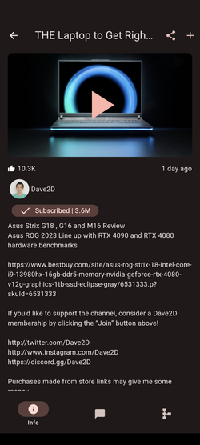
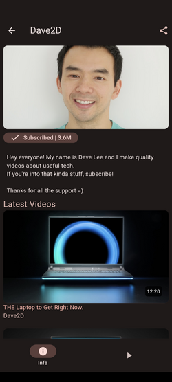

# Clipious

Android client application for [invidious](https://invidious.io), the privacy focused youtube front end

## Features

- Use own or public  server
- Subscription management
- SponsorBlock
- Video view/progress tracking
- user playlists
- background playback

## Screenshots

## Roadmap

- channels in search results
- Better user playlist handling
- Better video player for playlists
- Handling of youtube playlists
- vidoe quality selection
- Tablet UI
- Android TV support

