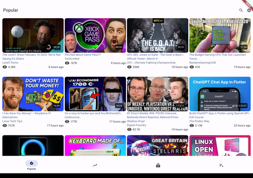
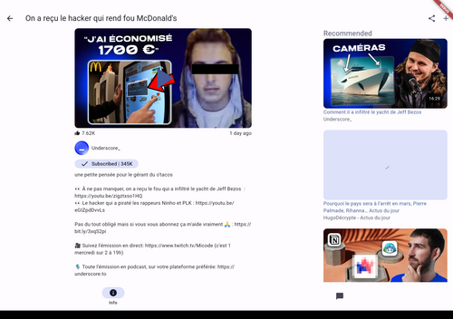
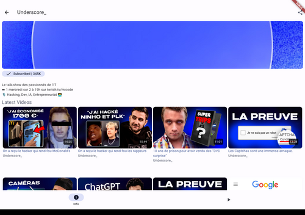

# Clipious

Android client application for [invidious](https://invidious.io), the privacy focused youtube front end

## License

Copyright (C) 2023 Paul Fauchon

This program is free software: you can redistribute it and/or modify
it under the terms of the GNU Affero General Public License as published
by the Free Software Foundation, either version 3 of the License, or
(at your option) any later version.

This program is distributed in the hope that it will be useful,
but WITHOUT ANY WARRANTY; without even the implied warranty of
MERCHANTABILITY or FITNESS FOR A PARTICULAR PURPOSE.  See the
GNU Affero General Public License for more details.

You should have received a copy of the GNU Affero General Public License
along with this program.  If not, see <https://www.gnu.org/licenses/>.

## Features

- Use own or public  server
- Subscription management
- SponsorBlock
- Video view/progress tracking
- Playlists
- background playback
- Live stream support
- Android TV ui

## Installation
The best way to install is to get it directly from the release page. Using [Obtainium](https://github.com/ImranR98/Obtainium) can help keeping the app up to date.

It is also available on IzzyOnDroid, and Accrescent:

## Screenshots
### Phone

### Tablet

### TV

## Contribute

### Translations

The translations are done via [weblate](https://hosted.weblate.org/projects/clipious/app-translation/).

## Liability

We take no responsibility for the use of our tool, or external instances
provided by third parties. We strongly recommend you abide by the valid
official regulations in your country. Furthermore, we refuse liability
for any inappropriate use of Invidious, such as illegal downloading.
This tool is provided to you in the spirit of free, open software.

You may view the LICENSE in which this software is provided to you [here](./LICENSE).

>   16. Limitation of Liability.
>
> IN NO EVENT UNLESS REQUIRED BY APPLICABLE LAW OR AGREED TO IN WRITING
WILL ANY COPYRIGHT HOLDER, OR ANY OTHER PARTY WHO MODIFIES AND/OR CONVEYS
THE PROGRAM AS PERMITTED ABOVE, BE LIABLE TO YOU FOR DAMAGES, INCLUDING ANY
GENERAL, SPECIAL, INCIDENTAL OR CONSEQUENTIAL DAMAGES ARISING OUT OF THE
USE OR INABILITY TO USE THE PROGRAM (INCLUDING BUT NOT LIMITED TO LOSS OF
DATA OR DATA BEING RENDERED INACCURATE OR LOSSES SUSTAINED BY YOU OR THIRD
PARTIES OR A FAILURE OF THE PROGRAM TO OPERATE WITH ANY OTHER PROGRAMS),
EVEN IF SUCH HOLDER OR OTHER PARTY HAS BEEN ADVISED OF THE POSSIBILITY OF
SUCH DAMAGES.
>

